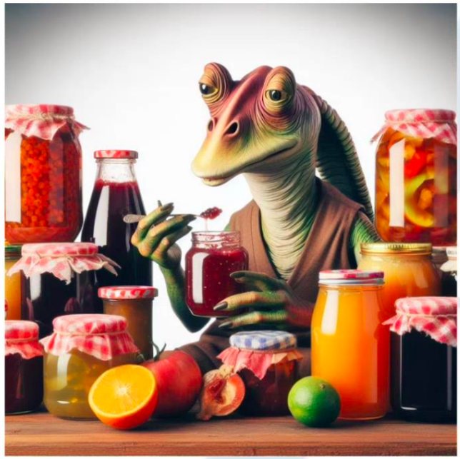

# Office Du Tourisme

## Description

This project is a website video game inspired by "GeoGuessr".<br>
The goal of the player is to find what happend around him, hence the name "Office Du Tourisme".

## Installation

1. Clone the repository

```bash
git clone git@github.com:ASM-Studios/officeDuTourisme-Front.git
```

2. Install the dependencies

```bash
npm install
```

3. Start the server

```bash
npm run dev
```

You will also need to run the [back-end](https://github.com/ASM-Studios/officeDuTourisme-Back) of the project.

## Technologies

- [Vite](https://vitejs.dev/)
- [React](https://reactjs.org/)
- [Material-UI](https://material-ui.com/)
- [Google Map API](https://developers.google.com/maps/documentation/javascript/overview)

## Contributors

- [Adrien AUDIARD](mailto:adrien.audiard@epitech.eu)
- [Mathieu BOREL](mailto:mathieu.borel@epitech.eu)
- [Yohann MANGENOT](mailto:yohann.mangenot@epitech.eu)
- [Charles MADJERI](mailto:charles.madjeri@epitech.eu)
- [Basile FOUQUET](mailto:basile.fouquet@epitech.eu)
- [Maël RABOT](mailto:mael.rabot@epitech.eu)


## Have fun !

